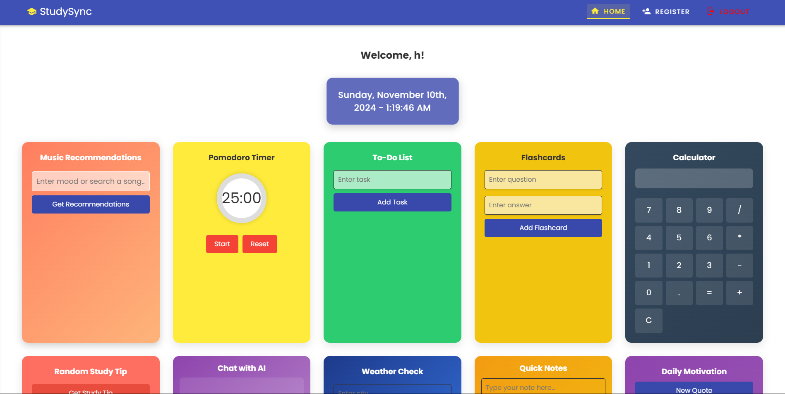
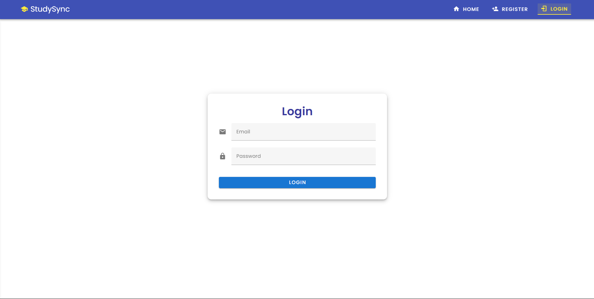
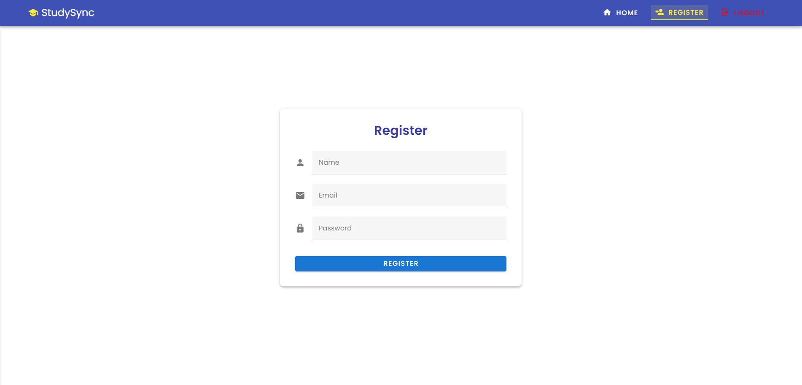

# StudySync - A Productivity and Study Companion App

Welcome to **StudySync**! StudySync is a productivity and study tool designed to help users stay organized and efficient. It includes a variety of features such as Pomodoro timers, music recommendations, weather checks, flashcards, to-do lists, and AI chat assistance. It integrates third-party services like Spotify for music and OpenWeather for weather data.

## Table of Contents

- [Features](#features)
- [Live Deployment](#live-deployment)
- [UI Screenshots](#ui-screenshots)
- [Tech Stack](#tech-stack)
- [File Structure](#file-structure)
- [API Documentation](#api-documentation)
- [Contributors](#creators)

## Features

- **Pomodoro Timer**: A built-in timer for Pomodoro study sessions.
- **Music Recommendations**: Get music suggestions based on mood using Spotify.
- **Flashcards**: Create, manage, and study flashcards.
- **To-Do List**: Track study tasks and assignments.
- **Calculator**: A scientific calculator for quick calculations.
- **AI Chat**: Chat with an AI assistant for study tips, help, and queries.
- **Weather Check**: Check the weather for any city using OpenWeather.
- **Quick Notes**: Take and store quick notes for your studies.
- **Daily Motivation**: Receive motivational quotes to keep you going.
- **Study Tips**: Get study tips and advice for effective learning.
- **User Authentication**: Register and login to access personalized features.
- **User Profile**: Craft your profile with study interests and goals.
- **Fully Responsive**: Works on all devices and screen sizes.
- **And More!**: Explore the app for additional features and tools.

## Live Deployment

The app is currently live at [https://study-sync-app.vercel.app/](https://study-sync-app.vercel.app/). You can explore the various features and functionalities of the app, including the Pomodoro timer, music recommendations, weather checks, and AI chat assistance.

The backend API is hosted on Render at [https://studysync-study-buddy-app.onrender.com](https://studysync-study-buddy-app.onrender.com/). The frontend is hosted on Vercel and communicates with the backend API for data retrieval and storage.

## UI Screenshots

Here are some placeholder UI images for the app:

1. **Home Page (Dashboard)**
   <p align="center">
     
   </p>

2. **Tools List**
   <p align="center">
     
   </p>

3. **Login Page**
   <p align="center">
     
   </p>

4. **Register Page**
    <p align="center">
      
    </p>

5. **404 Page**
   <p align="center">
     
   </p>

6. **Footer**
   <p align="center">
     
   </p>

## Tech Stack

- **Frontend**:

  - **Vue.js** (JavaScript Framework)
  - **Vuetify** (Material Design Components)
  - **Axios** (HTTP Requests)
  - **Vuex** (State Management)
  - Markdown Rendering with `marked` (for AI-generated responses)
  - **Webpack** (Module Bundler)
  - **Babel** (JavaScript Compiler)
  - **ESLint** (Code Linter)
  - **Prettier** (Code Formatter)
  - **Vue Router** (Page Navigation)
  - **Vue CLI** (Vue Command Line Interface)

- **Backend**:

  - **Node.js with Express.js**
  - **MongoDB** (Database)
  - **JWT** (Authentication)
  - **Spotify API** (for music recommendations)
  - **OpenWeather API** (for weather data)
  - **Gemini API** (for AI chat functionality)
  - **Swagger** (API Documentation)
  - **Nginx** (Reverse Proxy & Load Balancer)

- **Others**:
  - **Git and GitHub** for version control
  - **Google Gemini** (for AI chat functionality)
  - **OpenWeather API** (for weather data)
  - **Docker** (for containerization)
  - **Jenkins** (for CI/CD)
  - **Vercel and Render** for deployment

## Getting Started

To get started with **StudySync**, you can follow the setup instructions below. The project is divided into two main parts: the frontend and the backend. The frontend is built using Vue.js and Vuetify, while the backend is built using Node.js and Express.js. The backend uses MongoDB as the database.

1. **Clone the repository**:
   ```bash
   git clone https://github.com/hoangsonww/StudySync-Study-Buddy-App.git
   cd StudySync-Study-Buddy-App
   ```
2. **Set up the backend**:
   - Navigate to the `backend` directory:
     ```bash
     cd backend
     ```
   - Install backend dependencies:
     ```bash
     npm install
     ```
   - Set up environment variables by creating a `.env` file:
     ```
     SPOTIFY_CLIENT_ID=<your-spotify-client-id>
     SPOTIFY_CLIENT_SECRET=<your-spotify-client-secret>
     OPENWEATHER_API_KEY=<your-openweather-api-key>
     JWT_SECRET=<your-jwt-secret>
     GEMINI_API_TOKEN=<your-gemini-api-token>
     PORT=5000
     MONGO_URI=<your-mongo-uri>
     AI_INSTRUCTION=<your-ai-instruction>
     ```
   - Start the backend server:
     ```bash
     npm start
     ```
   - The backend server will start on `http://localhost:5000`.
3. **Set up the frontend**:

   - Navigate to the `frontend` directory:
     ```bash
     cd frontend/study-sync-app
     ```
   - Install frontend dependencies:
     ```bash
     npm install
     ```
   - Set up the frontend `.env` file with the API base URL:
     ```
     VUE_APP_API_URL=http://localhost:5000/api
     ```
   - Start the frontend development server:
     ```bash
     npm run serve
     ```
   - Open your browser and go to `http://localhost:8081` to view the app.

4. **Explore the app**:

   You can now explore the **StudySync** app by navigating through the various features and functionalities. You can use the Pomodoro timer, check the weather, get music recommendations, chat with the AI, and more.

5. **Contribute**:

   If you would like to contribute to the project, feel free to fork the repository and submit a pull request with your changes. We welcome contributions from the community!

## File Structure

```plaintext
StudySync-Study-Buddy-App/
│
├── backend/                            # Backend (Node.js + Express)
│   ├── config/                         # Database and configuration files
│   │   └── db.js                       # Database connection
│   ├── swagger/                        # Swagger API documentation
│   │   └── swagger.js                  # Swagger setup
│   ├── controllers/                    # Controllers handling requests
│   │   └── controllers.js              # Main controller file
│   ├── middleware/                     # Middleware for authentication
│   │   └── middleware.js               # Auth middleware to protect routes
│   ├── models/                         # Mongoose models (User, Group)
│   │   └── models.js                   # Mongoose models
│   ├── routes/                         # API Routes for endpoints
│   │   └── routes.js                   # Route definitions
│   ├── services/                       # External services (AI, Weather, Spotify)
│   │   └── services.js                 # Helper functions for services
│   ├── views/                          # Views (if using any templating engines)
│   ├── .env                            # Environment variables for sensitive data
│   ├── app.js                          # Main backend application file
│   ├── package.json                    # Backend dependencies
│   └── package-lock.json               # Lock file for backend dependencies
│
├── frontend/                           # Frontend (Vue.js + Vuetify)
│   ├── public/                         # Static files (favicon, index.html)
│   │   ├── favicon.ico                 # App favicon
│   │   ├── index.html                  # HTML template
│   ├── src/                            # Source code for frontend
│   │   ├── assets/                     # Static assets (images, logos, etc.)
│   │   │   ├── logo.png                # App logo
│   │   │   └── logo.svg                # SVG logo
│   │   ├── components/                 # Reusable Vue components
│   │   │   ├── ChatAI.vue              # AI Chat component
│   │   │   ├── FooterComponent.vue     # Footer component
│   │   │   ├── MusicRecommendation.vue # Music recommendation component
│   │   │   ├── NavbarComponent.vue     # Navbar component
│   │   │   ├── SearchProfiles.vue      # Search profiles component
│   │   │   ├── UserLogin.vue           # User login component
│   │   │   ├── UserRegister.vue        # User registration component
│   │   │   ├── UserProfile.vue         # User profiles component
│   │   │   └── StudyGroup.vue          # Study group component
│   │   ├── plugins/                    # Vue plugins (Vuetify, Axios)
│   │   │   ├── webfonloader.js         # Webfont loader
│   │   │   ├── axios.js                # Axios setup
│   │   │   └── vuetify.js              # Vuetify setup
│   │   ├── store/                      # Vuex store for global state management
│   │   │   └── index.js                # Vuex store setup
│   │   ├── router/                     # Vue Router for page navigation
│   │   │   └── index.js                # Router setup
│   │   ├── views/                      # Vue views for different pages
│   │   │   ├── HomePage.vue            # Home page view
│   │   │   └── DashboardPage.vue       # Dashboard view
│   │   ├── api.js                      # API service for making HTTP requests
│   │   ├── main.js                     # Main Vue application file
│   │   └── App.vue                     # Main Vue component
│   ├── .env                            # Environment variables for API URL
│   ├── babel.config.js                 # Babel configuration
│   ├── jsconfig.json                   # JavaScript configuration
│   ├── vue.config.js                   # Vue configuration
│   ├── package.json                    # Frontend dependencies
│   └── package-lock.json               # Lock file for frontend dependencies
│
├── .env                                # Environment variables for API keys and secrets
├── README.md                           # This README file
└── package.json                        # Root package.json file for the entire project
```

## API Documentation

### Table of API Endpoints

| **API Endpoint**            | **Method** | **Description**                                            |
|-----------------------------|------------|------------------------------------------------------------|
| `/auth/register`            | POST       | Registers a new user with name, email, and password.       |
| `/auth/login`               | POST       | Authenticates the user and returns a JWT token.            |
| `/profile/:userId?`         | GET        | Retrieves the profile data of the authenticated user.      |
| `/profile`                  | PUT        | Updates the profile information of the authenticated user. |
| `/search`                   | GET        | Searches for user profiles based on the query.             |
| `/weather`                  | GET        | Fetches weather data for a given city.                     |
| `/groups`                   | POST       | Creates a new study group.                                 |
| `/groups/:groupId/sessions` | POST       | Creates a new study session for the group.                 |
| `/cities`                   | GET        | Provides city suggestions based on a query.                |
| `/music`                    | GET        | Fetches music recommendations based on a mood.             |
| `/ai-chat`                  | POST       | Allows users to chat with the AI for study assistance.     |

### Backend Swagger Documentation

The backend API documentation is available at `http://localhost:5000/api-docs` after starting the backend server. The Swagger UI provides a detailed overview of the API endpoints, request parameters, and response data.

<p align="center">
  
</p>

### Example of calling the Music Recommendation API

```javascript
axios
  .get("http://localhost:5000/api/music?emotion=happy", {
    headers: {
      Authorization: `Bearer ${your_token}`,
    },
  })
  .then((response) => {
    console.log(response.data.recommendations); // Process music recommendations
  })
  .catch((error) => {
    console.error("Error fetching music:", error);
  });
```

### Authentication

All API endpoints require JWT authentication. Include the token in the `Authorization` header as follows:

```plaintext
Authorization: Bearer <your-jwt-token>
```

## Creators

- [Son Nguyen](https://github.com/hoangsonww)

---

We hope you enjoy using **StudySync**! For any issues or feature requests, feel free to open an issue on the repository. Happy studying!
